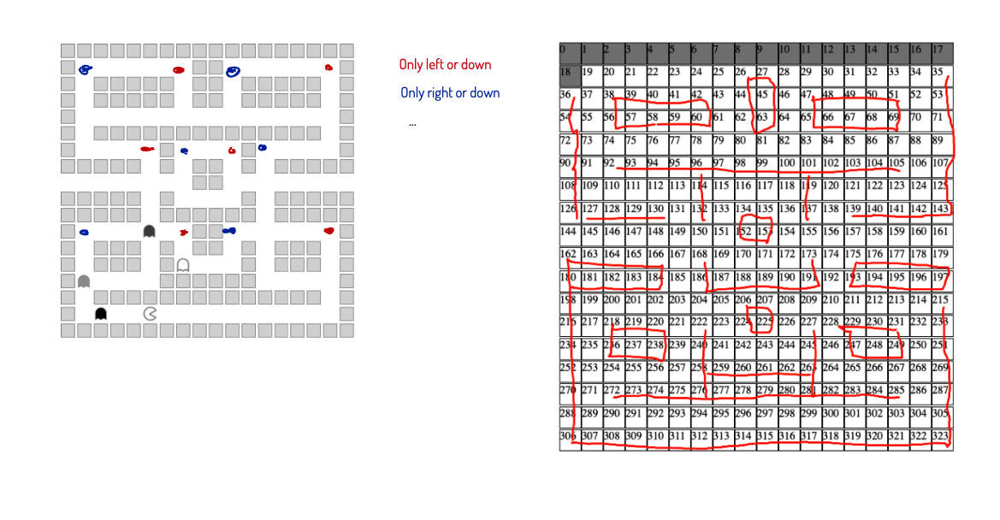
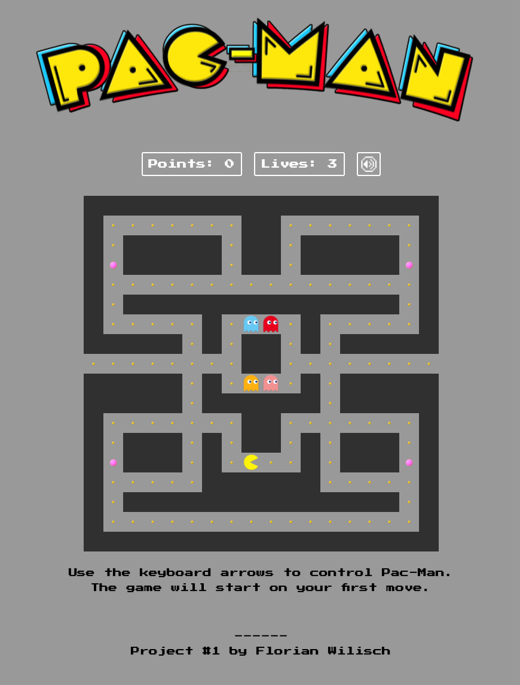
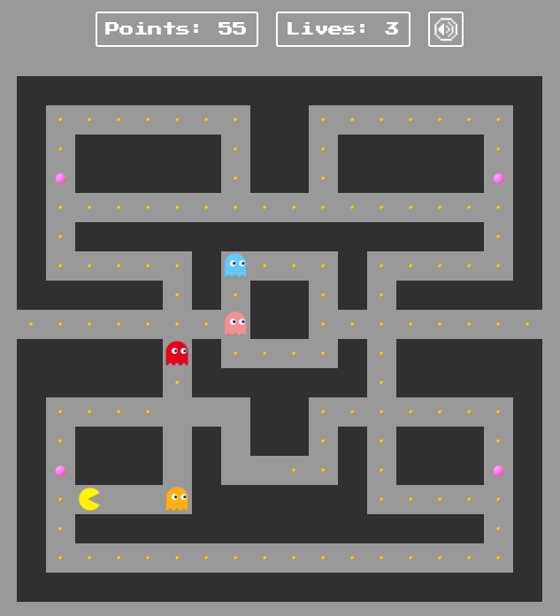
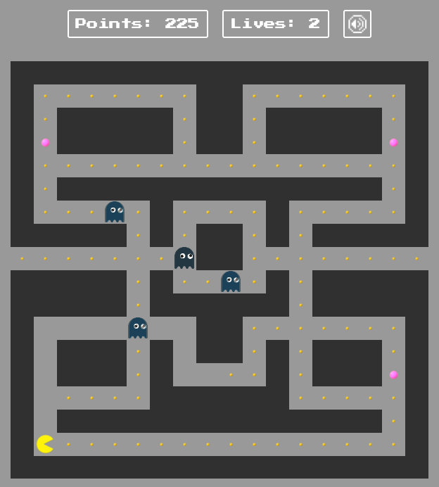

###  General Assembly, Software Engineering Immersive
# Pac-Man

```
   _ (`-.    ('-.                        _   .-')      ('-.         .-') _  
  ( (OO  )  ( OO ).-.                   ( '.( OO )_   ( OO ).-.    ( OO ) ) 
 _.`     \  / . --. /   .-----.          ,--.   ,--.) / . --. /,--./ ,--,'  
(__...--''  | \-.  \   '  .--./    .-')  |   `.'   |  | \-.  \ |   \ |  |\  
 |  /  | |.-'-'  |  |  |  |('-.  _(  OO) |         |.-'-'  |  ||    \|  | ) 
 |  |_.' | \| |_.'  | /_) |OO  )(,------.|  |'.'|  | \| |_.'  ||  .     |/  
 |  .___.'  |  .-.  | ||  |`-'|  '------'|  |   |  |  |  .-.  ||  |\    |   
 |  |       |  | |  |(_'  '--'\          |  |   |  |  |  | |  ||  | \   |   
 `--'       `--' `--'   `-----'          `--'   `--'  `--' `--'`--'  `--'   

```

## Overview
This is my first project as part of the software engineering immersive course at GA London. The assignment was to create a grid-based game to be rendered in the browser, using HTML, CSS and JavaScript. The project was to be completed **individually** within **one week**.

Given a list of options from GA, I chose to re-create the classic game **Pac-Man**. This game was estimated to have a difficulty level of 3 (out of 3), but I was encouraged by the instructors to go for it.

You can launch the game on GitHub pages [here](https://florian-wilisch.github.io/project-1/), or find the GitHub repo [here](https://github.com/florian-wilisch/project-1).

## Brief

- **Render a game in the browser**
- **Design logic for winning & visually display which player won**
- **Include separate HTML / CSS / JavaScript files**
- Stick with **KISS (Keep It Simple Stupid)** and **DRY (Don't Repeat Yourself)** principles
- Use **Javascript** for **DOM manipulation**
- **Deploy your game online**, where the rest of the world can access it
- Use **semantic markup** for HTML and CSS (adhere to best practices)

## Technologies
- HTML
- CSS
- JavaScript (ES6)
- Git and GitHub
- Graphic
- Google Fonts
- Ziteboard

## Approach
### Variables
I used a number of variables that would be call on at various times in the code.
- `width`: Made the grid size dynamic. This wasn't necessary for this game, but is good pracice.
- `cells`: An empty array that would be filled dynamically when creating the board. (see below)
- `path`: An array of all cell indexes that aren't walls. This allowed me to check wether a cell was a wall or a path to tell my characters where to go.


- `superfood`: The array of the superfood locations
- `pacmanPosition`, `blueGhostPosition`, `redGhostPosition`, `yellowGhostPosition`, `pinkGhostPosition`: Starting position for the different characters
- `playerPoints`: A variable to store the points
- `playerLives`: Starting at 3 this variable reduces each time a ghost catches Pac-Man
- `speed`: Having the speed in a variable allowed to change the speed of all intervals in one place. Note that the Pac-Mac speed was slightly increased (by setting it to `speed * .9`) to make the gameplay more fluid.

Mapping the grid:

### Board layout
I decided to create a dynamic grid by using a loop, depending on the variable `width`. Each cell created was added to the `cells` array and the CSS class for the cell types, walls and different characters added to the `classList`.
```
function createGrid(){
for (let i = 0; i < width ** 2; i++) {
  const div = document.createElement('div')
  div.classList.add('cell')
  grid.appendChild(div)
  cells.push(div)
  if (i === pacmanPosition) {
    div.classList.add('pacman')
  } else if (i === redGhostPosition) {
    div.classList.add('red-ghost')
  } else if 
    (...)
  } else {
    div.classList.add('wall')
  }
}
```

### Pac-Man movement
Pac-mans movement is started and directed with an `eventListener` listening to the arrow keys. A `setInterval` is then started to remove the CSS class from one cell and add it to the next.
```
document.addEventListener('keydown', (action) => {
  const key = action.key
  if (key === 'ArrowRight' && !(cells[pacmanPosition + 1].classList.contains('wall'))) {
    clearInterval(pacMvmt)
    pacMvmt = setInterval(() => {
      cells[pacmanPosition].classList.remove('pacman')
      cells[pacmanPosition].classList.add('no-background')
      (...)
      cells[pacmanPosition].classList.add('pacman')
      countFoodPoints()
      document.querySelector('.player-points').innerHTML = `Points: ${playerPoints}`
      if ((cells[pacmanPosition + 1].classList.contains('wall')) && pacmanPosition !== 161) {
        clearInterval(pacMvmt)
      }
    }, (speed * .9))
  } else if (key === 'ArrowDown' && !(cells[pacmanPosition + width].classList.contains('wall'))) {
  (...)
  }
})
```
### Pathfinding
Pathfinding is the algorithm that calculates the fastest route from A to B on a grid with obstacles. This was certainly the most difficult part of the project, particularly because both points - A and B - are constantly moving so the algorithm needs to be constately recalculated (see below 'Ghost movement').

I found a relatively simple pathfinding code [here](http://www.gregtrowbridge.com/a-basic-pathfinding-algorithm/) and implemented it. However this algorythm uses X and Y coordinates to locate cells while I used an ongoing cell index.
This meant that I had to convert cells back and forth for my codebase to work with this one.

```
//Cell Number to coordinates
  let x = cellNum % width
  let y = Math.floor(cellNum / width)

//Coordinates to Cell Number
  cellNum = (y * width) + x
```

### Ghost movement
To allow the algorithm to be calculated over and over for each ghost, I had to clone the array each time before running the pathfinding algorithm. 
```
const arrayCopy = rowArray.map((arr) => {
  return [...arr]
})
```

The algorithm return an array of directions every time. I'd grab the first direction ('North', 'South', 'East', 'West') and move the ghost.
```
nextPath = findShortestPath([gy,gx], arrayCopy)
cells[redGhostPosition].classList.remove('red-ghost')
(...)
nextStep = nextPath[0]
if (nextStep === 'North') {
  redGhostPosition -= width
} else if (nextStep === 'South') {
  redGhostPosition += width
} else if (nextStep === 'West') {
  redGhostPosition -= 1
} else if (nextStep === 'East') {
  redGhostPosition += 1
}
cells[redGhostPosition].classList.add('red-ghost')
```
### Ghost personalities
It's a little known fact that the different ghosts in Pac-Man actually have 'personalities':

_'Blinky gives direct chase to Pac-Man, Pinky and Inky try to position themselves in front of Pac-Man, usually by cornering him, and Clyde will switch between chasing Pac-Man and fleeing from him.'_ [Wikipedia](https://en.wikipedia.org/wiki/Pac-Man)

Trying to replicate this, I decided have the red ghost always aim straight for the location of Pac-Man. The blue ghost always aims for two cells before Pac-Man. The pink ghost aims for two cells after Pac-Mans position. And the yellow ghost switches every 20 steps between finding Pac-Man and fleeing from him.

### Ghosts fleeing
When Pac-Man eats the so-called super food, for approximately 15 seconds the game switches and Pac-Man can eat the ghosts while they are trying to flee.

After trying to write a single block of code for the fleeing behaviour of the ghosts I realised that it would be too hard given their different personalities. So I built the fleeing behaviour into each ghosts movement interval.

The basic logic is that depending on where Pac-Man is, the ghosts will each run into a specified corner of the board.

```
//When fleeing, if Pac-Man is in the upper right quarter of the grid aim for (6, 7), else aim for (1, 16) - the upper right corner.

if (redFleeing) {
  (...)
  if (py <= 8 && px > 8) {
        arrayCopy[6][7] = 'Goal'
      } else {
        arrayCopy[1][16] = 'Goal'
      }
```


### Collisions
For collisions I've simply checked at every interval of every ghost movement whether their position is the same as Pac-Mans current position.
```
if (((gy * width) + gx) === (py * width) + px) { 
  clearAndReset()
} else {
  (...)
}
```
(see Bugs section for more comments and thoughts)


### Toggle / Counter variables
At various places in the code I set 'toggle or counter variables'. I've used these  when requiring a certain behaviour for specific number of intervals.
For example for disabling the fleeing behaviour after 15 steps:

```
let redFleeing = false
let redFleeingCounter = 0
(...)
  if (redFleeing) {
    redFleeingCounter += 1
  (...)
  }
  if (redFleeingCounter === 15) {
    redFleeing = false
    redFleeingCounter = 0
  }
```

## Screenshots

#### Start screen


#### Play screen & Flee screen
 

## Challenges / Victories
### Different characters of ghosts
Giving the ghosts different characters was important as they'd otherwise just be taking the same path towards Pac-Man. I tried to replicate the characters they have in the original game but I didn't manage to implement a good solution for *Inky* and *Pinky* ('[...] position themselves in front of Pac-Man'). They are now always aiming at a couple of cells before or after Pac-Man, which means that when they come close, they actually stop hunting and move away. As a solution to this I could have built in a switch in the behaviour when these ghosts get close to Pac-Man - their target position would then become Pac-Man (and maybe switch back after a few steps).
### Pathfinding
The pathfinding algorithm was fairly straightforward to unxderstand but it user coordinates rather then a simple number to identify a cell. There's advantages and disadvantages to both techniques but using both made it sometimes tricky to combine the information and pass it back and forth.
### DRY
From the beginning it felt wrong to be repeating a lot of the code for each ghost. I tried to avoid this by passing 'ghost variables' into the functions but it just ended up making things much more complicated. Therefor I had to retreat and multiply the code. I should have started with this and then looked at optimising later! 

## Key Learnings
* Learned to create automated (ghost) and player activated movement
* Learned to understand a pathfinding algorythm and to implement it
* Learned to create game 'states' without React using variables
## Bugs
### Collision failing: 
Pac-Man and the ghosts seem to regularly miss each other. I believe this must be down to the fact that, at the moment of collision, they are switching cells at exactly the same time, meaning that they are never on the same cell at the same time.

I'd probably fix this by keeping track of the current and previous position of all ghosts and Pac-Man. Then collision could be defined, not only when they are on the same cell but also when their current-previous position pair are the same but inverted. 

For ex:
```
let pacman = [147, 148]
let blueGhost = [148,147]

==> COLLISION
```
## Potential future features 
- Ghosts starting on the middle island: I started implementing this (instead of having them start on the path cells) but it was actually more complicated than expected due to the 'wall cells' not being breachable.
- Make it mobile responsive.
- Implement different levels, by increasing speed variable.
- Local storage for leaderboard.

## Images & audio
- pacman.co
- [Noun Project](https://thenounproject.com/)
- Logo from google